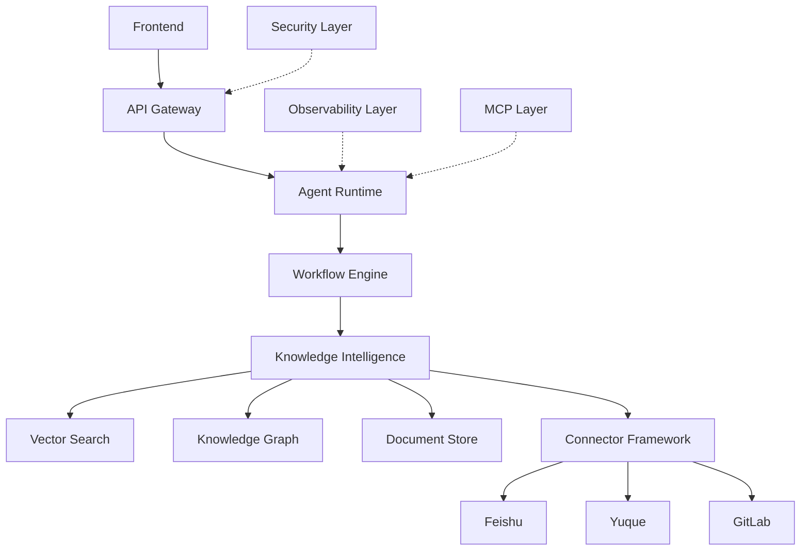
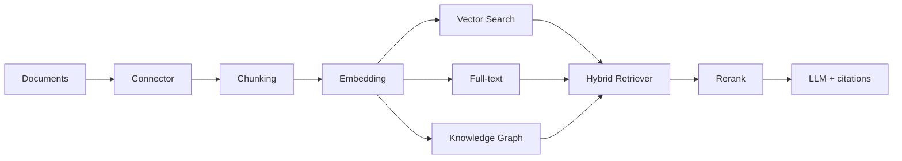
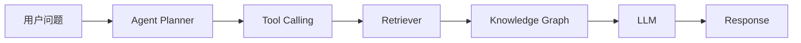
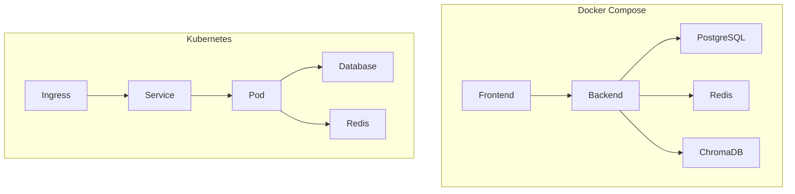

<div align="center">


# Enterprise AI Agent Platform

企业级知识库 Agent：**Document Processing · Hybrid RAG · Vector Search · Permission Control**

企业级 AI Agent 平台，支持知识智能、Workflow 自动化、多租户、安全治理和云原生部署。

[English](README_EN.md) · [Release Guide](docs/RELEASE_GUIDE.md) · [Contributing](CONTRIBUTING.md) · [Security](SECURITY.md)

[](https://github.com/zhifengjin050-arch/enterprise-ai-agent-platform/actions/workflows/ci.yml)
[]()
[]()
[]()
[]()
[]()

</div>

---

## 项目介绍

这不是聊天机器人。这是一套把企业知识变成可执行自动化的基础设施：

- 从飞书 / 语雀 / GitLab 接入文档
- 用混合检索 + 知识图谱回答问题
- 用 Agent Runtime 规划并调用工具
- 用 Workflow Engine 编排审批与故障处理
- 用 JWT / RBAC / 多租户隔离保护数据
- 用 Docker Compose 或 Kubernetes / Helm 部署

适合 SRE、DevOps、AI 工程师和平台团队作为私有化知识 Copilot 与 Agent 运行时。

完整架构说明见 [docs/images/system_architecture.md](docs/images/system_architecture.md)。

---

## 核心能力

| Module | Capability |
|--------|------------|
| Connector Framework | 飞书 / 语雀 / GitLab 连接器，统一配置与同步记录 |
| Sync Engine | 全量 / 增量同步、作业调度、失败重试 |
| Knowledge Intelligence | 智能分块、分类打标、文档生命周期 |
| Hybrid RAG | 向量检索 + 全文检索融合 |
| Knowledge Graph | 实体 / 关系抽取与图查询 |
| Agent Runtime | Planner、Tool Registry、Memory、LLM Gateway |
| Workflow Engine | DAG 节点、审批、触发器、执行生命周期 |
| Multi Tenant Security | JWT、RBAC、租户隔离、API Key、审计日志 |
| Observability | OpenTelemetry、Prometheus、Grafana、LLM 成本 |
| MCP Integration | 工具发现、注册、远程 MCP 调用 |
| Docker | 一键 `docker compose up -d` |
| Kubernetes | Deployment / Service / HPA / Ingress |
| Helm | `charts/enterprise-ai-platform` |

### Feature Matrix

完整条目见 [docs/showcase/FEATURE_MATRIX.md](docs/showcase/FEATURE_MATRIX.md)。

| Area | v1.0.0 |
|------|--------|
| Connector Framework | 飞书 / 语雀 / GitLab，统一配置与同步记录 |
| Sync Engine | 全量 / 增量、作业、重试、断点 |
| Knowledge Intelligence | Markdown / PDF / DOCX 分块、分类打标 |
| Hybrid RAG | 向量 + 全文 + 可选 rerank |
| Knowledge Graph | 实体 / 关系抽取与图查询 |
| Agent Runtime | Planner、Tool Registry、Memory、LLM Gateway |
| Workflow Engine | DAG、审批、API / Webhook / Schedule 触发 |
| Multi Tenant Security | JWT、RBAC、租户隔离、API Key、审计 |
| Observability | OpenTelemetry、Prometheus、Grafana、LLM 成本 |
| MCP Integration | 工具发现、注册、远程调用 |
| Docker / K8s / Helm | Compose + Manifest + Chart + HPA |

---

## 系统架构




Security Layer（JWT / RBAC / Tenant / Audit）、Observability Layer（Trace / Metrics / Alert）与 MCP Layer（Discovery / Registry / Remote tools）横切运行时。

---

## RAG Pipeline


企业知识库检索管线：连接器接入文档 → 分块 / Embedding → 向量检索 + 全文 + 知识图谱 → 融合与 Rerank → LLM 带引用作答。权限在租户与 RBAC 边界内生效。



### Evaluation

| Check | Result |
|-------|--------|
| Stable pytest (workflow excluded on Windows) | 998 passed, 3 skipped |
| `python -m compileall app/` | success |
| Frontend production build | success |
| Retrieval | Hybrid vector + BM25; optional graph boost and rerank |

Quality notes: [docs/RELEASE_GUIDE.md](docs/RELEASE_GUIDE.md). Workflow suite is executed in CI with timeout protection.

---

## 数据流



---

## 部署架构



| 方式 | 入口 |
|------|------|
| Docker Compose | [`docker-compose.yml`](docker-compose.yml) |
| Kubernetes | [`deploy/kubernetes/`](deploy/kubernetes/) |
| Helm | [`charts/enterprise-ai-platform/`](charts/enterprise-ai-platform/) |

```bash
helm install enterprise-ai ./charts/enterprise-ai-platform \
  --namespace enterprise-ai --create-namespace
```

---

## 技术栈

| Layer | Stack |
|-------|--------|
| Backend | Python 3.11+ · FastAPI · SQLAlchemy 2.0 (async) · Alembic |
| Frontend | React 18 · TypeScript · Vite · Tailwind · shadcn/ui |
| Data | PostgreSQL 16 · Redis 7 · ChromaDB |
| AI | DeepSeek / OpenAI compatible LLM · Hybrid RAG |
| Ops | Prometheus · Grafana · OpenTelemetry · Docker · Helm |

---

## 快速开始

```bash
git clone https://github.com/zhifengjin050-arch/enterprise-ai-agent-platform.git
cd enterprise-ai-agent-platform
cp .env.example .env
# 可选：写入 LLM_API_KEY 与 JWT_SECRET
docker compose up -d
```

Windows:

```powershell
Copy-Item .env.example .env
.\scripts\demo_start.ps1
```

Linux / macOS:

```bash
./scripts/demo_start.sh
```

默认入口：

| 服务 | URL |
|------|-----|
| Dashboard | http://localhost |
| API / OpenAPI | http://localhost:8000/docs |
| Grafana | http://localhost:3000 (`admin` / `admin`) |

Demo 租户 `CloudTech`、用户 `admin` / `admin123`、Agent `Enterprise Assistant`、Workflow `Incident Analysis` 会由 seed 脚本写入。打开控制台后先登录。重置：

```bash
./scripts/demo_reset.sh
```

生产环境务必设置 `JWT_SECRET`，并限制 `CORS_ORIGINS`。详见 [SECURITY.md](SECURITY.md)。

---

## API 示例

OpenAPI：http://localhost:8000/docs

```bash
# Health
curl http://localhost:8000/api/health

# Login
curl -X POST http://localhost:8000/api/auth/login \
  -H "Content-Type: application/json" \
  -d '{"username":"admin","password":"admin123"}'

# Hybrid RAG search
curl -X POST http://localhost:8000/api/knowledge/search \
  -H "Content-Type: application/json" \
  -d '{"query":"Pod OOM","top_n":5}'

# Execute agent (JWT required)
curl -X POST http://localhost:8000/api/agents/<agent_id>/execute \
  -H "Authorization: Bearer <token>" \
  -H "Content-Type: application/json" \
  -d '{"query":"生产环境 Pod 频繁 OOM，应该怎么排查？"}'
```

| Prefix | Area |
|--------|------|
| `/api/health` | 健康检查 |
| `/api/auth` | 登录 / JWT |
| `/api/knowledge` | 文档与混合检索 |
| `/api/agents` | Agent CRUD 与执行 |
| `/api/workflows` | 工作流定义与运行 |
| `/api/connectors` | 连接器配置 |
| `/metrics` | Prometheus |

---

## 测试结果

| Check | Result |
|-------|--------|
| `python -m compileall app/` | success |
| pytest 稳定套件（排除 Windows 上会挂起的 workflow） | **998 passed, 3 skipped** |
| `cd frontend && npm run build` | success |
| Docker Compose / Kubernetes / Helm | 清单与 Chart 已就绪 |

CI：`.github/workflows/ci.yml`（lint + pytest + bandit + frontend build）。

---

## Roadmap

**v1.0.0（当前）**：Agent Runtime、Hybrid RAG、Knowledge Graph、Workflow、Connector、多租户安全、可观测性、MCP、Docker / K8s / Helm。

后续（不在本发布范围内）：

- Connector / Security 独立 Dashboard 页面
- 更多连接器与评测集
- Workflow 可视化编排增强

---

## 截图

| Dashboard | Agent | Knowledge |
|-----------|-------|-----------|
|  |  |  |

| Architecture | RAG Pipeline |
|--------------|--------------|
|  |  |

更多运行时页面（Workflow / Monitor）与 Product Preview 见 `docs/screenshots/`。

---

## 文档

- [Release Guide](docs/RELEASE_GUIDE.md)
- [Final Release Report](docs/FINAL_RELEASE_REPORT.md)
- [Interview Guide](docs/INTERVIEW_GUIDE.md)
- [Architecture](docs/showcase/ARCHITECTURE_OVERVIEW.md)
- [Feature Matrix](docs/showcase/FEATURE_MATRIX.md)
- [Changelog](CHANGELOG.md)
- [GitHub 仓库创建说明](docs/GITHUB_PUBLISH.md)
- [Release Checklist](docs/GITHUB_RELEASE_CHECKLIST.md)

---

## License

Apache-2.0 · 见 [LICENSE](LICENSE)

贡献前请阅读 [CONTRIBUTING.md](CONTRIBUTING.md) 与 [CODE_OF_CONDUCT.md](CODE_OF_CONDUCT.md)。
