<div align="center">

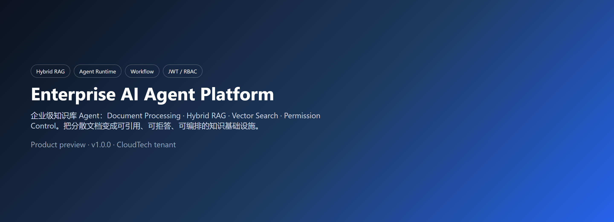

# Enterprise AI Agent Platform

**Enterprise knowledge-base Agent: document processing, hybrid RAG, vector search, and permission control.**

An enterprise AI Agent platform with knowledge intelligence, workflow automation, multi-tenant security, and cloud-native deployment.

[中文](README.md) · [Release Guide](docs/RELEASE_GUIDE.md) · [Contributing](CONTRIBUTING.md) · [Security](SECURITY.md)

[](https://github.com/zhifengjin050-arch/enterprise-ai-agent-platform/actions/workflows/ci.yml)
[]()
[]()
[]()
[]()
[]()

</div>

---

## Introduction

This is not a chatbot. It is infrastructure that turns enterprise knowledge into executable automation:

- Ingest documents from Feishu, Yuque, and GitLab
- Answer with hybrid retrieval plus a knowledge graph
- Plan and call tools through the Agent Runtime
- Orchestrate approvals and incident handling with the Workflow Engine
- Isolate tenants with JWT, RBAC, API keys, and audit logs
- Deploy with Docker Compose or Kubernetes / Helm

Built for SRE, DevOps, AI, and platform engineers who need a private knowledge copilot.

See [docs/images/system_architecture.md](docs/images/system_architecture.md) for the full diagrams.

---

## Demo

[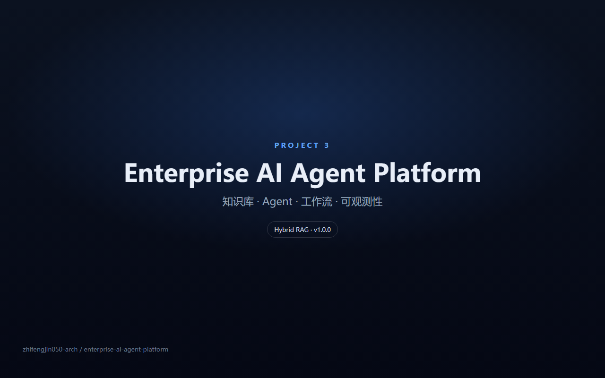](docs/videos/demo.mp4)

Click the cover to watch the walkthrough (Chinese narration + subtitles).

---

## Capabilities

| Module | Capability |
|--------|------------|
| Connector Framework | Feishu / Yuque / GitLab connectors with unified config |
| Sync Engine | Full and incremental sync, jobs, retries |
| Knowledge Intelligence | Chunking, tagging, document lifecycle |
| Hybrid RAG | Vector search fused with full-text search |
| Knowledge Graph | Entity / relation extraction and graph query |
| Agent Runtime | Planner, tool registry, memory, LLM gateway |
| Workflow Engine | DAG nodes, approvals, triggers, run lifecycle |
| Multi Tenant Security | JWT, RBAC, tenant isolation, API keys, audit |
| Observability | OpenTelemetry, Prometheus, Grafana, LLM cost |
| MCP Integration | Tool discovery, registry, remote MCP calls |
| Docker | One-command `docker compose up -d` |
| Kubernetes | Deployment / Service / HPA / Ingress |
| Helm | `charts/enterprise-ai-platform` |

### Feature Matrix

Full list: [docs/showcase/FEATURE_MATRIX.md](docs/showcase/FEATURE_MATRIX.md).

| Area | v1.0.0 |
|------|--------|
| Connector Framework | Feishu / Yuque / GitLab, unified config and sync records |
| Sync Engine | Full / incremental jobs, retries, checkpoints |
| Knowledge Intelligence | Markdown / PDF / DOCX chunking and tagging |
| Hybrid RAG | Vector + full-text + optional rerank |
| Knowledge Graph | Entity / relation extraction and graph query |
| Agent Runtime | Planner, tool registry, memory, LLM gateway |
| Workflow Engine | DAG, approval, API / Webhook / Schedule triggers |
| Multi Tenant Security | JWT, RBAC, tenant isolation, API keys, audit |
| Observability | OpenTelemetry, Prometheus, Grafana, LLM cost |
| MCP Integration | Discovery, registry, remote calls |
| Docker / K8s / Helm | Compose + manifests + chart + HPA |

---

## Architecture

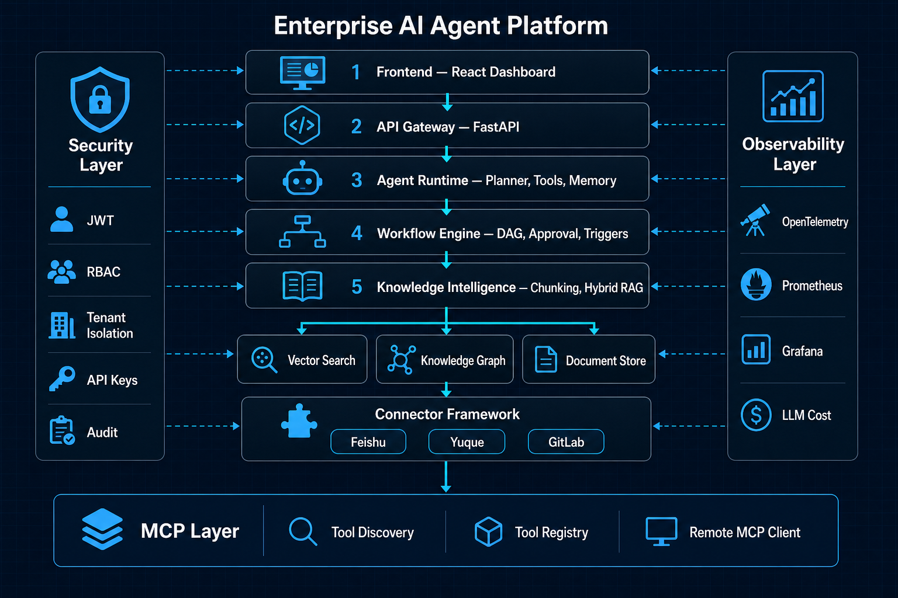

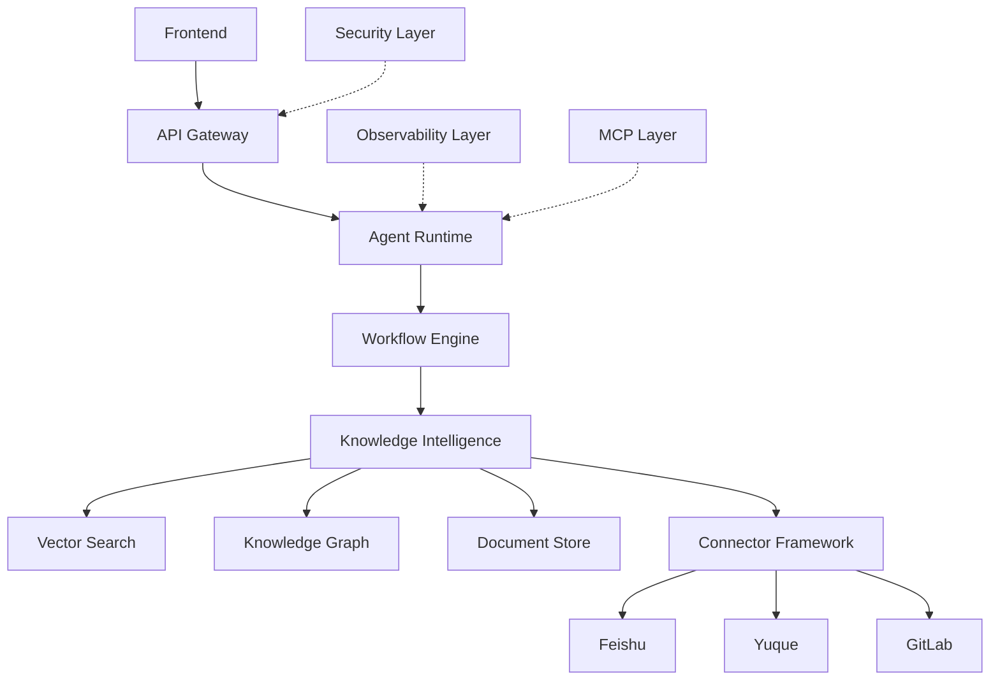

A Security Layer (JWT / RBAC / tenant / audit), Observability Layer (traces / metrics / alerts), and MCP Layer (discovery / registry / remote tools) cut across the runtime.

---

## RAG Pipeline

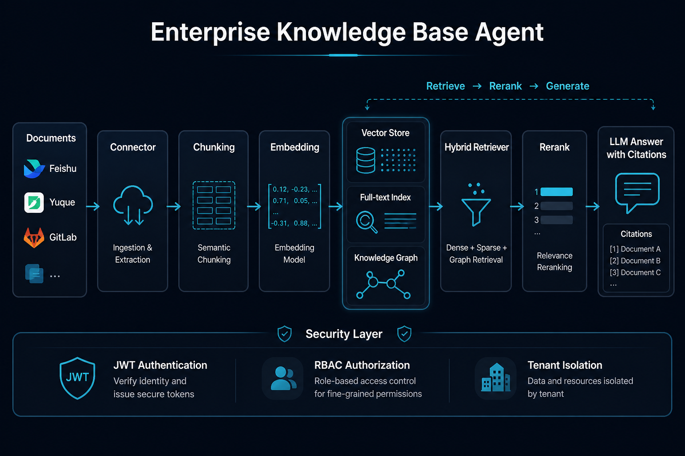

Connectors ingest documents → chunk / embed → vector + full-text + graph → hybrid retrieve → rerank → LLM answer with citations. Access is bounded by tenant isolation and RBAC.

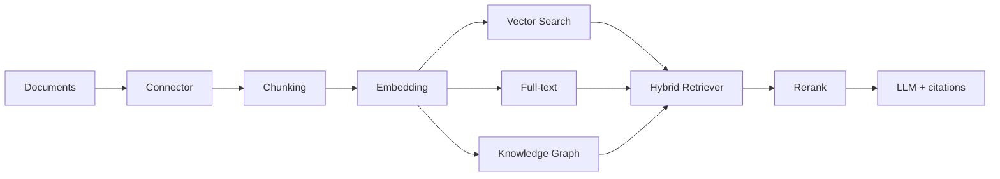

### Evaluation

| Check | Result |
|-------|--------|
| Stable pytest (workflow excluded on Windows) | 998 passed, 3 skipped |
| `python -m compileall app/` | success |
| Frontend production build | success |
| Retrieval | Hybrid vector + BM25; optional graph boost and rerank |

See [docs/RELEASE_GUIDE.md](docs/RELEASE_GUIDE.md). The workflow suite runs in CI with timeout protection.

---

## Data flow

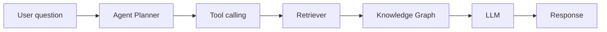

---

## Deployment

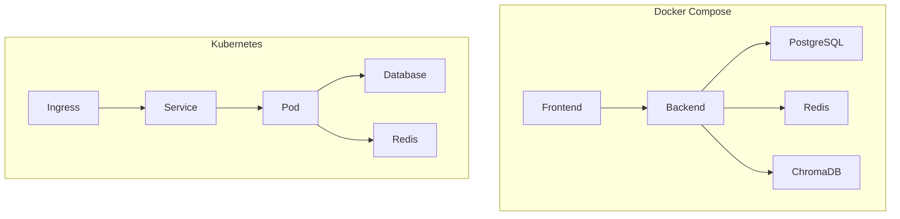

```bash
helm install enterprise-ai ./charts/enterprise-ai-platform \
  --namespace enterprise-ai --create-namespace
```

---

## Tech stack

FastAPI · SQLAlchemy 2.0 · React 18 · TypeScript · PostgreSQL · Redis · ChromaDB · Prometheus · Grafana · Docker · Helm

---

## Quick start

```bash
git clone https://github.com/zhifengjin050-arch/enterprise-ai-agent-platform.git
cd enterprise-ai-agent-platform
cp .env.example .env
docker compose up -d
# Linux/macOS
./scripts/demo_start.sh
# Windows
.\scripts\demo_start.ps1
```

| Service | URL |
|---------|-----|
| Dashboard | http://localhost |
| OpenAPI | http://localhost:8000/docs |
| Grafana | http://localhost:3000 |

Demo tenant `CloudTech`, user `admin`, agent `Enterprise Assistant`, workflow `Incident Analysis`.

Set `JWT_SECRET` and restrict `CORS_ORIGINS` before any public deploy. See [SECURITY.md](SECURITY.md).

---

## API examples

OpenAPI: http://localhost:8000/docs

```bash
curl http://localhost:8000/api/health

curl -X POST http://localhost:8000/api/auth/login \
  -H "Content-Type: application/json" \
  -d '{"username":"admin","password":"admin123"}'

curl -X POST http://localhost:8000/api/knowledge/search \
  -H "Content-Type: application/json" \
  -d '{"query":"Pod OOM","top_n":5}'

curl -X POST http://localhost:8000/api/agents/<agent_id>/execute \
  -H "Authorization: Bearer <token>" \
  -H "Content-Type: application/json" \
  -d '{"query":"How should we debug frequent Pod OOM in production?"}'
```

| Prefix | Area |
|--------|------|
| `/api/health` | Health |
| `/api/auth` | Login / JWT |
| `/api/knowledge` | Documents and hybrid search |
| `/api/agents` | Agent CRUD and execute |
| `/api/workflows` | Definitions and runs |
| `/api/connectors` | Connector config |
| `/metrics` | Prometheus |

---

## Test results

| Check | Result |
|-------|--------|
| `python -m compileall app/` | success |
| pytest stable suite (workflow excluded on Windows hang) | **998 passed, 3 skipped** |
| `cd frontend && npm run build` | success |
| Docker Compose / Kubernetes / Helm | manifests and chart ready |

CI: `.github/workflows/ci.yml`.

---

## Roadmap

**v1.0.0 (current):** Agent Runtime, Hybrid RAG, Knowledge Graph, Workflow, Connectors, multi-tenant security, observability, MCP, Docker / K8s / Helm.

Later (out of this release):

- Dedicated Connector / Security dashboard pages
- More connectors and eval sets
- Richer workflow visual designer

---

## Screenshots

| Dashboard | Agent | Knowledge |
|-----------|-------|-----------|
| 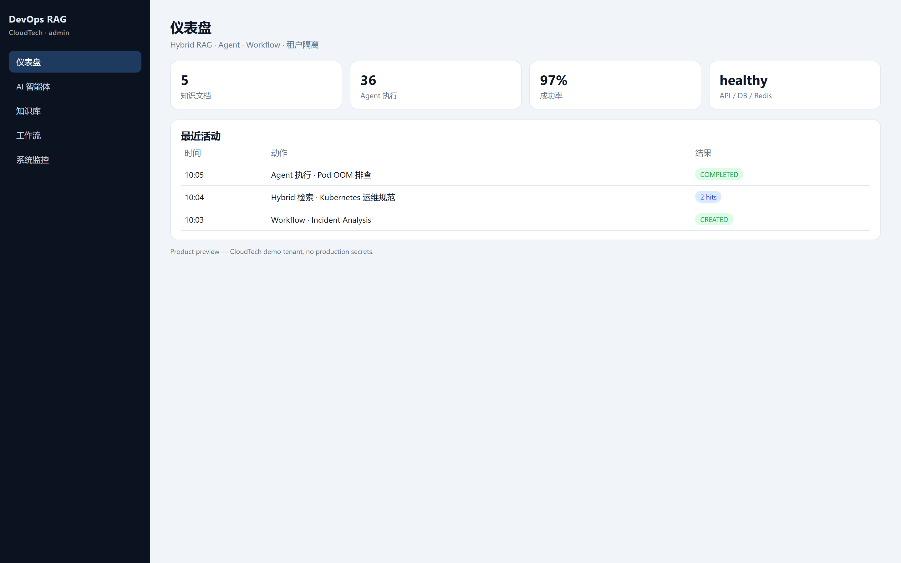 | 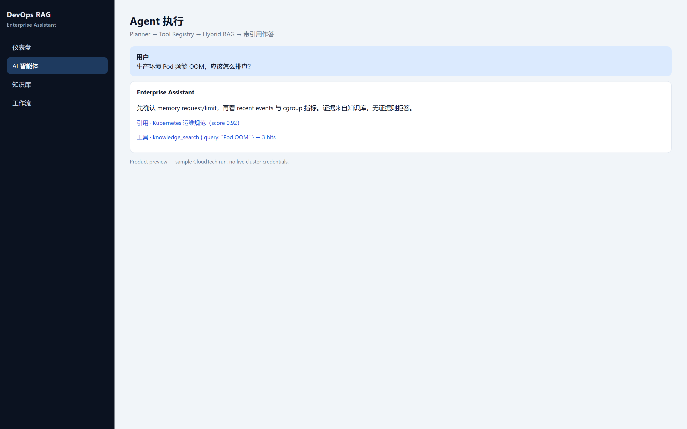 | 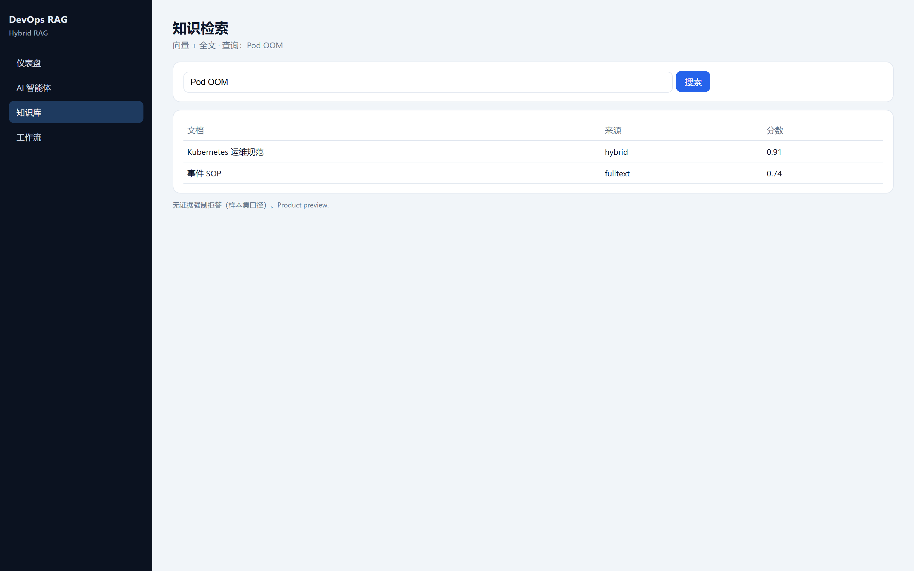 |

| Architecture | RAG Pipeline |
|--------------|--------------|
|  |  |

Additional runtime pages live in `docs/screenshots/`.

---

## License

Apache-2.0. See [LICENSE](LICENSE).

Contribute via [CONTRIBUTING.md](CONTRIBUTING.md) and [CODE_OF_CONDUCT.md](CODE_OF_CONDUCT.md).

More: [Release Guide](docs/RELEASE_GUIDE.md) · [GitHub publish notes](docs/GITHUB_PUBLISH.md) · [Checklist](docs/GITHUB_RELEASE_CHECKLIST.md)
