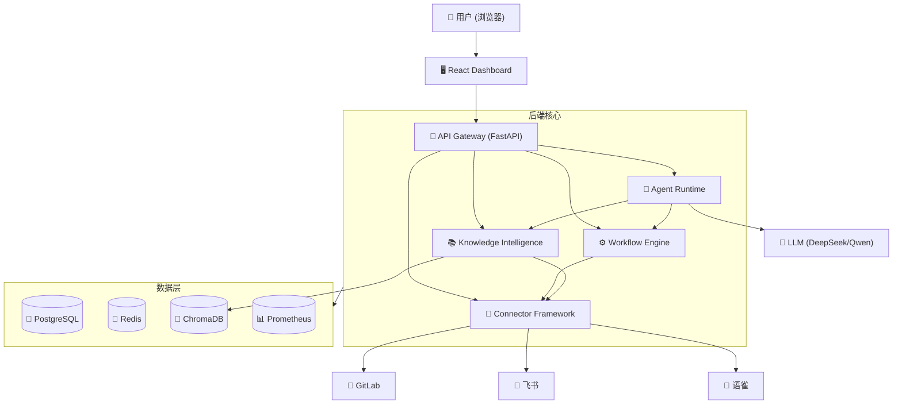

# 产品化计划 — Enterprise AI Agent Platform v1.0

> 本文档基于当前项目结构（v0.10.0, Phase 9 完成）分析，制定从技术平台到可交付产品的完整升级路径。

---

## 1. 当前项目状态分析

### 1.1 已完成技术栈

| 层 | 技术 | 状态 |
|---|------|------|
| **后端框架** | FastAPI (异步) | ✅ 已生产化 |
| **数据库** | SQLAlchemy 2.0 + Alembic (11 个迁移版本) | ✅ 已生产化 |
| **向量存储** | ChromaDB | ✅ 已集成 |
| **认证** | JWT + RBAC + API Key + 多租户隔离 | ✅ 已生产化 |
| **可观测性** | OpenTelemetry + Prometheus + 结构化日志 + 审计 | ✅ 已生产化 |
| **AI Agent** | Planner + Tool Registry + Memory + Context Engine + LLM Gateway | ✅ 已生产化 |
| **知识管理** | 智能分块 + 混合检索 + 知识图谱 + RAG Pipeline | ✅ 已生产化 |
| **工作流引擎** | DAG + Trigger + Approval + 执行生命周期 | ✅ 已生产化 |
| **连接器** | 飞书/语雀/GitLab + Capability + Factory + Registry | ✅ 已生产化 |
| **同步引擎** | 增量同步 + Checkpoint + Cursor Recovery | ✅ 已生产化 |

### 1.2 缺失项（需要本次实现）

| 缺失项 | 说明 | 优先级 |
|-------|------|--------|
| **前端 Dashboard** | 无前端，纯后端服务 | 🔴 P0 |
| **Demo 数据** | 无示例数据和初始化脚本 | 🔴 P0 |
| **Docker 一键部署** | 存在基础 Docker，但无前端+监控整合 | 🔴 P0 |
| **README 重新设计** | 现有 README 为开发文档，非开源项目首页 | 🟡 P1 |
| **CI/CD** | 无 GitHub Actions | 🟡 P1 |
| **代码质量工具** | 无 ruff/pyproject.toml/pre-commit | 🟡 P1 |
| **Kubernetes 部署** | 无 Helm Chart/K8s manifests | 🟡 P1 |
| **MCP Server** | 无 MCP 工具适配层 | 🟡 P1 |
| **产品化文档** | 缺少架构图（可嵌入 README） | 🟢 P2 |

### 1.3 现有基础设施

```
Dockerfile          → 多阶段构建 (python:3.12-slim)
docker-compose.yml  → app + postgres + redis + chroma
deploy/             → Prometheus + Grafana 配置
.env.example        → 环境变量模板
pytest.ini          → asyncio_mode = auto
docs/               → 9 份架构文档
```

---

## 2. 整体架构（目标）

```
┌─────────────────────────────────────────────────────────┐
│                    Browser (用户)                         │
├─────────────────────────────────────────────────────────┤
│              Frontend (React + Tailwind + shadcn/ui)     │
│     /dashboard  /agents  /knowledge  /workflows  /monitor│
├─────────────────────────────────────────────────────────┤
│              API Gateway (FastAPI)                       │
├─────────────────────────────────────────────────────────┤
│   Agent Runtime  │  Workflow Engine  │  Knowledge Intel  │
│   ┌──────────┐   │  ┌────────────┐   │  ┌────────────┐  │
│   │ Planner  │   │  │ DAG Nodes │   │  │ Chunking  │  │
│   │ Tools    │   │  │ Triggers  │   │  │ Retrieval │  │
│   │ Memory   │   │  │ Approval  │   │  │ Graph     │  │
│   │ LLM Gate │   │  │ Executor  │   │  │ RAG       │  │
│   └──────────┘   │  └────────────┘   │  └────────────┘  │
├──────────────────┴──────────────────┴──────────────────┤
│              Connector Framework + Sync Engine           │
├─────────────────────────────────────────────────────────┤
│   PostgreSQL  │  Redis  │  ChromaDB  │  Prometheus      │
└─────────────────────────────────────────────────────────┘
```

---

## 3. 执行计划

### Step 1: Phase 10-A — 企业 AI 助手 Demo（最高优先级）

**目标：** 让打开浏览器的人 5 分钟理解项目价值。

#### 前端技术选型

```
React 18 + TypeScript
TailwindCSS
shadcn/ui (组件库)
React Router v6
Recharts (图表)
Lucide React (图标)
React Flow (工作流图)
```

#### 页面清单

| 页面 | 路由 | 数据来源 | 复杂度 |
|------|------|---------|--------|
| Dashboard | `/` | health API + metrics API | ⭐⭐ |
| Agent 管理 | `/agents` | agent API + agents API | ⭐⭐⭐ |
| 知识管理 | `/knowledge` | knowledge API + search API | ⭐⭐⭐ |
| 工作流视图 | `/workflows` | workflows API | ⭐⭐⭐⭐ |
| 系统监控 | `/monitor` | metrics API + Prometheus | ⭐⭐ |

#### 实现策略

1. 使用 Vite 脚手架创建 `frontend/` 目录
2. 配置 TailwindCSS + shadcn/ui
3. 实现 API 服务层（对接后端全部 REST API）
4. 实现 5 个核心页面
5. 添加 Nginx 反向代理到 Docker Compose
6. 运行 `pytest` 验证后端未受影响

---

### Step 2: Phase 10-B — 企业 Demo 数据

#### 模拟文档

| 文件 | 内容 |
|------|------|
| `examples/demo/documents/k8s_ops.md` | Kubernetes 运维规范 |
| `examples/demo/documents/api_docs.md` | 公司 API 文档 |
| `examples/demo/documents/dev_process.md` | 研发流程规范 |
| `examples/demo/documents/incident_sop.md` | 故障处理 SOP |
| `examples/demo/documents/security_policy.md` | 安全规范 |

#### 初始化脚本

`scripts/init_demo_data.py` 流程：

1. 读取 Markdown 文档
2. 通过 Connector API 导入文档
3. Sync Engine 触发同步
4. Knowledge Intelligence 执行分块 + Embedding
5. 知识图谱构建实体关系
6. 输出完成日志

#### 验证

用户可以直接询问："Kubernetes Pod OOM 怎么处理？"

Agent 预期返回：
- 答案
- 来源文档
- 相关实体
- 推荐操作

---

### Step 3: Phase 10-C — Docker 一键部署

#### Docker Compose 架构

```
docker-compose.yml
├── app (backend)
│   ├── Dockerfile (已有，优化)
│   └── .env
├── frontend (新增)
│   ├── Dockerfile (Nginx + React build)
│   └── nginx.conf (反向代理 /api/* → backend)
├── postgres (已有)
├── redis (已有)
├── chroma (已有)
├── prometheus (新增/从 deploy/ 移入)
└── grafana (新增/从 deploy/ 移入)
```

#### 环境变量

更新 `.env.example` 包含所有必要配置。

#### 验证

```bash
docker compose up -d
curl http://localhost:8000/api/health
curl http://localhost:5173/  # 前端
```

---

### Step 4: Phase 11 — 开源工程化

#### README 重新设计

包含：
- 项目介绍 + 定位（不是普通聊天机器人）
- 架构图（ASCII 或 Mermaid）
- Feature 列表（8 大核心能力）
- Quick Start（Docker 启动，3 步完成）
- Demo 截图占位符
- Roadmap
- License (Apache 2.0)

#### CI/CD

`.github/workflows/ci.yml`:

```yaml
on: [push, pull_request]
jobs:
  test:
    - install dependencies
    - pytest
    - compileall
  lint:
    - ruff check
  build:
    - docker build
```

#### 代码质量工具

| 文件 | 用途 |
|------|------|
| `ruff.toml` | Python linter 配置 |
| `pyproject.toml` | 项目元数据 + ruff/mypy/pytest 配置 |
| `.pre-commit-config.yaml` | 提交前检查 |

---

### Step 5: Phase 12 — 企业部署 + MCP

#### Kubernetes 部署

```
deploy/kubernetes/
├── namespace.yaml
├── deployment.yaml
├── service.yaml
├── configmap.yaml
└── secret.yaml

charts/
└── enterprise-ai-platform/
    ├── Chart.yaml
    ├── values.yaml
    ├── templates/
    │   ├── _helpers.tpl
    │   ├── deployment.yaml
    │   ├── service.yaml
    │   ├── ingress.yaml
    │   ├── configmap.yaml
    │   ├── secret.yaml
    │   └── hpa.yaml
    └── charts/
        ├── postgres/
        └── redis/
```

#### MCP 能力增强

```
app/mcp/
├── __init__.py
├── adapter.py       # MCP Tool Adapter
├── registry.py      # MCP Tool Registry
└── tools/
    ├── __init__.py
    ├── gitlab.py     # GitLab MCP Tool
    ├── kubernetes.py # Kubernetes MCP Tool
    └── database.py   # Database MCP Tool
```

集成方式：通过 `ToolRegistry` 统一注册，Agent Runtime 透明调用。

---

## 4. 安全检查清单

所有新增 API 必须：

- [x] `require_permission` 装饰器
- [x] `tenant_id` 隔离
- [x] Audit 日志记录
- [ ] 前端所有请求带 JWT Token
- [ ] Docker 部署默认开启安全配置
- [ ] Kubernetes Secret 管理敏感信息

---

## 5. 测试要求

| 阶段 | 新增测试 | 数量 |
|------|---------|------|
| 10-A | frontend API 端点测试 | ~20 |
| 10-B | demo data 导入验证测试 | ~10 |
| 10-C | Docker health check 测试 | ~5 |
| 12 | MCP tool 测试 | ~20 |
| 12 | K8s manifest 验证测试 | ~5 |

**目标总数：1200+ → 1500+**

---

## 6. 依赖管理

### 前端依赖 (package.json)

```json
{
  "dependencies": {
    "react": "^18.3.0",
    "react-dom": "^18.3.0",
    "react-router-dom": "^6.26.0",
    "recharts": "^2.12.0",
    "lucide-react": "^0.441.0",
    "@radix-ui/react-*": "latest"
  },
  "devDependencies": {
    "typescript": "^5.5.0",
    "tailwindcss": "^3.4.0",
    "vite": "^5.4.0",
    "@vitejs/plugin-react": "^4.3.0"
  }
}
```

### 后端新增依赖 (requirements.txt)

```
# MCP
mcp>=1.0.0

# Kubernetes client (optional)
kubernetes>=30.0.0
```

---

## 7. 执行时间预估

| 步骤 | 内容 | 预估时间 |
|------|------|---------|
| Step 1 | 项目分析 + PRODUCTIZATION_PLAN.md | ✅ 已完成 |
| Step 2 | Phase 10-A: Frontend Dashboard | 2-3 小时 |
| Step 3 | Phase 10-B: Demo 数据 | 30 分钟 |
| Step 4 | Phase 10-C: Docker 部署 | 1 小时 |
| Step 5 | Phase 11: 开源工程化 | 1 小时 |
| Step 6 | Phase 12: K8s + MCP | 2 小时 |

---

## 8. 架构图 (Mermaid)



---

## 9. 下一步

确认本计划后，按以下顺序执行：

```
Step 2 → Phase 10-A: 创建 frontend/ 项目结构
         → 实现 5 个核心页面
         → Nginx 整合 Docker Compose
         → 验证测试

Step 3 → Phase 10-B: 创建 examples/demo/documents/
         → 实现 scripts/init_demo_data.py
         → 验证知识问答链路

Step 4 → Phase 10-C: 更新 docker-compose.yml
         → 创建 frontend Dockerfile
         → .env.example 更新

Step 5 → Phase 11: README 重设计
         → .github/workflows/ci.yml
         → ruff.toml + pyproject.toml + pre-commit

Step 6 → Phase 12: deploy/kubernetes/
         → charts/ 目录
         → app/mcp/ 模块
         → 安全审计 + 测试
```