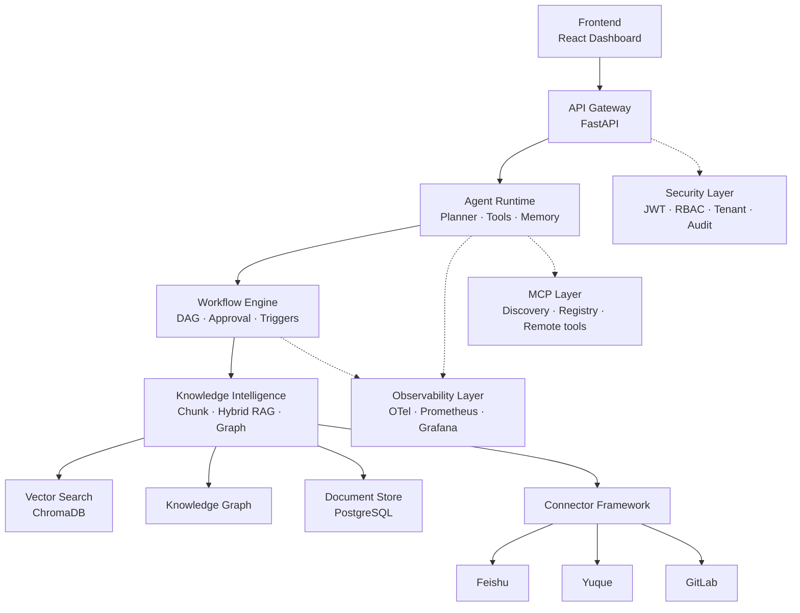
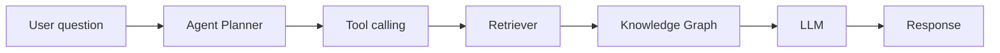
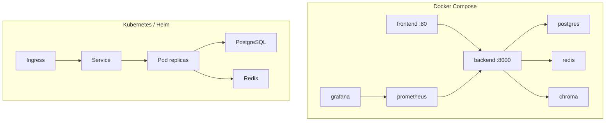

# System architecture

Mermaid source used by the project README. Rendered natively on GitHub.

## Layered architecture

```mermaid
flowchart TB
    Frontend["Frontend<br/>React Dashboard"]
    API["API Gateway<br/>FastAPI"]
    Agent["Agent Runtime<br/>Planner · Tools · Memory"]
    Workflow["Workflow Engine<br/>DAG · Approval · Triggers"]
    Knowledge["Knowledge Intelligence<br/>Chunk · Hybrid RAG · Graph"]
    Vector["Vector Search<br/>ChromaDB"]
    Graph["Knowledge Graph"]
    Docs["Document Store<br/>PostgreSQL"]
    Connector["Connector Framework"]
    Feishu["Feishu"]
    Yuque["Yuque"]
    GitLab["GitLab"]

    Frontend --> API
    API --> Agent
    Agent --> Workflow
    Workflow --> Knowledge
    Knowledge --> Vector
    Knowledge --> Graph
    Knowledge --> Docs
    Knowledge --> Connector
    Connector --> Feishu
    Connector --> Yuque
    Connector --> GitLab

    Security["Security Layer<br/>JWT · RBAC · Tenant · Audit"]
    Observability["Observability Layer<br/>OTel · Prometheus · Grafana"]
    MCP["MCP Layer<br/>Discovery · Registry · Remote tools"]
    API -.-> Security
    Agent -.-> Observability
    Agent -.-> MCP
    Workflow -.-> Observability
```

## Request data flow

```mermaid
flowchart LR
    Q["User question"] --> P["Agent Planner"]
    P --> T["Tool calling"]
    T --> R["Retriever"]
    R --> G["Knowledge Graph"]
    G --> L["LLM"]
    L --> A["Response"]
```

## Deployment topology

```mermaid
flowchart TB
    subgraph compose [Docker Compose]
        FE["frontend :80"]
        BE["backend :8000"]
        PG["postgres"]
        RD["redis"]
        CH["chroma"]
        PR["prometheus"]
        GR["grafana"]
        FE --> BE
        BE --> PG
        BE --> RD
        BE --> CH
        PR --> BE
        GR --> PR
    end

    subgraph k8s [Kubernetes / Helm]
        Ing["Ingress"]
        Svc["Service"]
        Pod["Pod replicas"]
        Ing --> Svc --> Pod
        Pod --> ExtDB["PostgreSQL"]
        Pod --> ExtRD["Redis"]
    end
```
