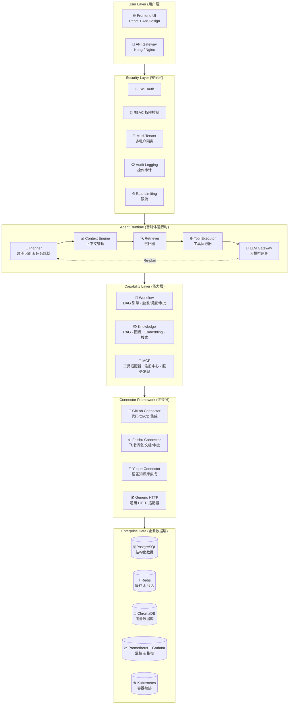

# 企业级 DevOps RAG 知识库 Agent — 架构总览

## 一、整体架构图



## 二、分层说明

### 1. 用户层 (User Layer)

提供统一的交互入口，支持 **Web UI**（React + Ant Design）和 **RESTful API**（Kong/Nginx 网关）。用户可以通过聊天界面或 API 直接与 Agent 交互，上传文档、查询知识、发起工作流。

### 2. 安全层 (Security Layer)

企业级安全防护体系：

- **JWT Auth** — 基于 JSON Web Token 的身份认证，支持 token 刷新与吊销。
- **RBAC** — 基于角色的访问控制，细粒度到 API 端点与知识库文档级别。
- **Multi-Tenant** — 多租户数据隔离，每个租户拥有独立的向量空间与配置。
- **Audit Logging** — 全链路操作审计，记录谁、何时、做了什么，满足合规要求。
- **Rate Limiting** — 令牌桶限流策略，防止恶意请求与资源滥用。

### 3. 智能体运行时 (Agent Runtime)

核心推理引擎，采用 **Plan-then-Execute** 架构：

| 模块 | 职责 |
|------|------|
| **Planner** | 接收用户意图，拆解为多步执行计划；支持动态重规划 |
| **Context Engine** | 维护会话上下文、历史摘要、引用来源跟踪 |
| **Retriever** | 多路召回：向量检索 + 关键词搜索 + 知识图谱查询，结果融合重排序 |
| **Tool Executor** | 执行 Planner 编排的工具调用，处理入参校验与结果解析 |
| **LLM Gateway** | 统一的大模型接入层，支持多模型路由、Failover、Token 用量监控 |

运行时通过 **ReAct** 循环实现规划-执行-观察的闭环，LLM Gateway 返回结果后若需补充信息则触发重规划。

### 4. 能力层 (Capability Layer)

三大核心能力引擎：

- **Workflow** — 基于 DAG 的工作流引擎，支持定时触发、事件驱动、人工审批节点。用于自动化 DevOps 流水线，如"检测 GitLab MR → 触发代码审查 → 写入飞书文档"。
- **Knowledge** — 知识管理中枢，包含 RAG 检索增强生成、知识图谱构建与查询、Embedding 模型管理、全文搜索。支持文档上传、自动切片、向量化入库。
- **MCP** — 模型上下文协议（Model Context Protocol）适配层，提供工具注册中心、服务发现、统一调用接口。第三方工具可通过 MCP 协议快速接入。

### 5. 连接层 (Connector Framework)

标准化企业数据源连接器：

- **GitLab Connector** — 对接 GitLab API，获取项目、MR、CI Pipeline、代码文件等 DevOps 数据。
- **Feishu Connector** — 对接飞书开放平台，发送消息、读取文档、发起审批、查询日历。
- **Yuque Connector** — 对接语雀 API，同步知识库文档作为 RAG 数据源。
- **Generic HTTP** — 通用 HTTP 适配器，支持自定义认证与数据转换，快速对接任意 REST 服务。

### 6. 数据层 (Enterprise Data)

底层基础设施与数据存储：

- **PostgreSQL** — 业务数据、用户信息、工作流状态、审计日志。
- **Redis** — 会话缓存、任务队列、实时状态、限流计数。
- **ChromaDB** — 向量数据库，存储文档 Embedding，支持语义检索。
- **Prometheus + Grafana** — 全链路指标采集、可视化仪表盘、告警规则。
- **Kubernetes** — 容器编排平台，提供自动伸缩、滚动更新、服务发现。

## 三、数据流说明

一次典型的用户请求完整数据流如下：

```
用户请求
    ↓
① API Gateway — 路由转发、TLS 终止
    ↓
② Security Layer — JWT 验证 → RBAC 鉴权 → 多租户上下文注入 → 审计日志记录
    ↓
③ Planner — 意图识别 → 任务拆解 → 生成 DAG 执行计划
    ↓
④ Context Engine — 加载会话历史 → 注入当前上下文
    ↓
⑤ Retriever — 并行执行向量检索 + 关键词搜索 + 图谱查询 → 结果融合重排序
    ↓
⑥ Tool Executor — 按计划依次调用工具（GitLab / Feishu / Yuque 等）
    ↓
⑦ LLM Gateway — 组装 Prompt → 调用大模型 → 流式返回 → Token 统计
    ↓
⑧ 结果经 Context Engine 整理 → 返回给用户
```

若 LLM 返回结果不满足需求，Planner 会发起**动态重规划**，补充查询或调整策略后重新执行。

## 四、部署架构

### Docker Compose（7 核心服务）

| 服务 | 镜像 | 端口 | 说明 |
|------|------|------|------|
| `api-gateway` | kong:3.5 | 8000/8443 | API 网关 |
| `agent-runtime` | enterprise-agent:latest | 8080 | Agent 运行时 |
| `knowledge-service` | knowledge-svc:latest | 8081 | 知识管理服务 |
| `workflow-engine` | workflow-engine:latest | 8082 | DAG 工作流引擎 |
| `mcp-registry` | mcp-registry:latest | 8083 | MCP 工具注册中心 |
| `postgres` | postgres:15 | 5432 | 业务数据库 |
| `redis` | redis:7 | 6379 | 缓存 & 队列 |

### Kubernetes + Helm

生产环境部署于 Kubernetes 集群，使用 Helm Chart 统一管理：

```yaml
# values.yaml 核心配置
global:
  replicaCount: 3
  imageRegistry: registry.example.com
  env: production

agent-runtime:
  resources:
    requests: { cpu: "2", memory: "4Gi" }
    limits: { cpu: "4", memory: "8Gi" }
  autoscaling:
    enabled: true
    minReplicas: 3
    maxReplicas: 10
    targetCPUUtilizationPercentage: 75

knowledge-service:
  resources:
    requests: { cpu: "1", memory: "2Gi" }
    limits: { cpu: "2", memory: "4Gi" }
  chromaDb:
    enabled: true
    persistence: 100Gi

workflow-engine:
  resources:
    requests: { cpu: "1", memory: "2Gi" }

monitoring:
  prometheus:
    enabled: true
    retention: 15d
  grafana:
    enabled: true
    dashboards:
      - agent-performance
      - knowledge-metrics
      - workflow-monitor
```

**部署特性**：

- **自动伸缩** — 根据 CPU 与请求量自动扩缩 Pod
- **滚动更新** — 零宕机升级，健康检查保障服务可用
- **持久化存储** — PostgreSQL 与 ChromaDB 使用 PVC，保证数据不丢失
- **监控告警** — Prometheus 采集指标，Grafana 可视化，Alertmanager 推送告警
- **日志中心** — 结构化日志输出至 ELK/Loki，支持全文检索
- **灰度发布** — 基于 Istio 的流量权重路由，支持金丝雀发布

---

> **文档版本**: v1.0 | **最后更新**: 2026-08-18
>
> 本文档为求职展示用途，详细设计文档请参阅 `docs/` 目录下的专题文档。